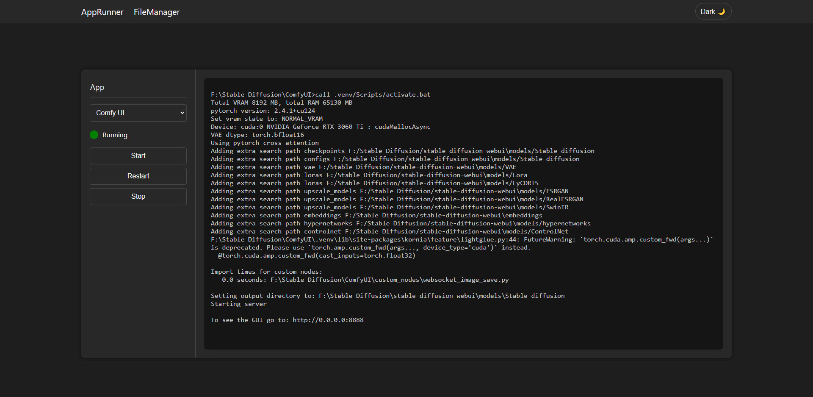
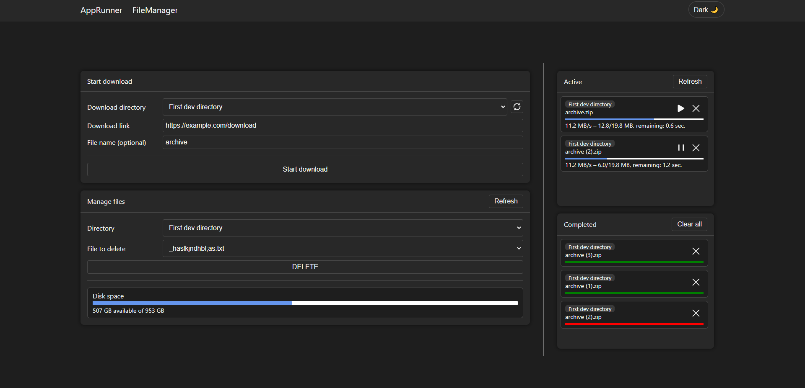

# RemoteFileManager

A web app that allows simple remote apps and file management on the host machine. With it, you can:
- Start, restart, stop console apps and view their logs
- Download files from url
- Delete files in a directory
- See available and total disk space

App uses SignalR for realtime server-client communication. Multiple clients can use this app at the same time.

# Table of contents
- [Installation](#installation)
- [Configuration](#configuration)
- [Usage](#usage)

# Installation
- Make sure you have ``.NET 8 sdk`` installed
- Clone repo ``git clone https://github.com/CompleXss/RemoteFileManager.git``
- To build framework-dependent app (executable size is ~200 KB), run:
  + ``build.bat`` on Windows
  + ``build.sh`` on Linux
- To build framework-independent app (executable size is ~100 MB), run:
  + ``build_self_contained.bat`` on Windows
  + ``build_self_contained.sh`` on Linux

---

If you want to just run the app and not publish it:
1. ``cd RemoteFileManager`` (into the inner folder)
2. Run one of the following (or use your IDE instead):

```shell
# To run in debug mode
dotnet run

# To run in release mode
dotnet run -c Release
```

Also, you can run ``dotnet publish`` with [options](https://learn.microsoft.com/en-us/dotnet/core/tools/dotnet-publish#options) manually if you want to customize build behaviour.<br/>
After using build scripts or ``dotnet publish`` the app is ready to be used outside of this project folder.

# Configuration
To configure app, edit ``appsettings.json`` which looks like this:
```json
{
  "AppRunner": {
    "AppPaths": {
      "TestApp": "C:/test/app.bat"
    },
    "MaxLogsCountPerApp": 256
  },
  "FileManager": {
    "AllowedDirectories": [
      {
        "Name": "Test directory",
        "Path": "./test/",
        "CreateAllowed": true,
        "EditAllowed": true
      }
    ],
    "QueryParams": [
      {
        "HostWildcard": "example.com/download",
        "Params": {
          "token": "my-token"
        }
      }
    ],
    "FilesChangesLogFile": "./logs/files-changes.log"
  },
  "Logging": {
    "LogLevel": {
      "Default": "Information",
      "System.Net.Http": "Warning",
      "Microsoft.AspNetCore": "Warning"
    }
  },
  "AllowedHosts": "*",
  "Urls": "http://0.0.0.0:7007"
}
```

### What these settings mean
1. `AppRunner/AppPaths` - display names and paths of console apps
2. `AppRunner/MaxLogsCountPerApp` - max number of log lines to keep in memory per app
3. `FileManager/AllowedDirectories` - directories available to clients where:
```
"Name"           - directory name that will be shown to client
"Path"           - path to directory (client won't see it)
"CreateAllowed"  - allows client to download files into this directory
"EditAllowed"    - allows client to edit and delete files in this directory
```
4. `FileManager/QueryParams` (optional) - query params that should be added to download url if it contains `HostWildcard`
5. `FileManager/FilesChangesLogFile` (optional) - location of the log file with `"file was created / file was deleted"` contents
5. `Urls` - address and port for `https` and/or `http` protocols (`0.0.0.0` means `localhost` but available for other computers in the same network)
6. `AllowedHosts` - who can connect to the app. * (star) means everyone

### Note the following
* `FileManager/AllowedDirectories` section supports hot reload. You can change this section while app is running
* All `AllowedDirectories` are locked when app is running so you can't delete/change them. If you remove directory from `AllowedDirectories` (when app is working) it will become unlocked
* Paths may be either absolute or relative

# Usage
### AppRunner
- Select an app
- View its status (running / stopped) and logs
- Start, restart, stop it



### FileManager
- Download: select directory, paste file link, specify file name (if you want to), hit `Start download`
- Delete: select directory, select file, hit `Delete`, confirm
- Disk space shows info for directory selected in block "Manage files"
- Pause / resume / cancel downloads


